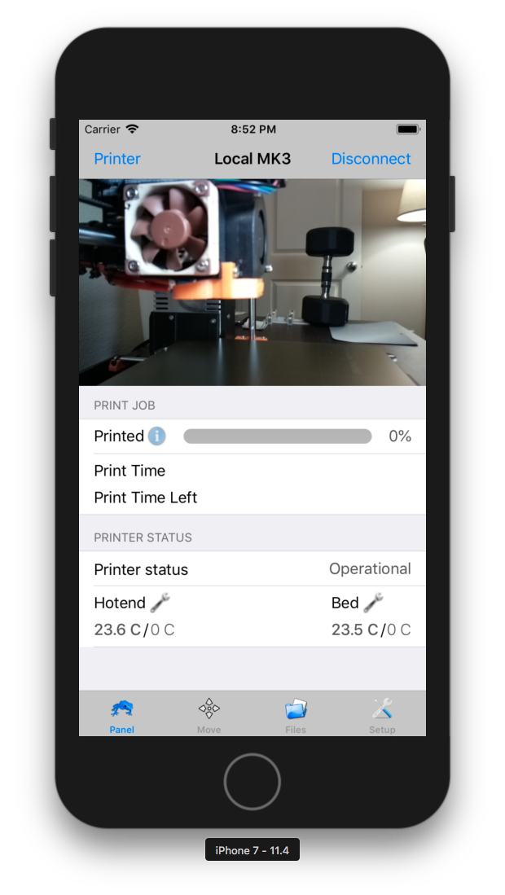

# OctoPod
OctoPod is a free open source iPhone app for OctoPrint.

## Build Instructions

### Download Xcode

You will need to install Swift 4.0 and Xcode 9.3 or newer.

#### CocoaPods

OctoPod uses [CocoaPods](http://cocoapods.org/) to manage third party libraries.

Trying to build the project by itself (_OctoPod.xcodeproj_) after launching will result in
an error, as the resources managed by CocoaPods are not included. To install and configure the
third party libraries just run the following in the command line:

`pod install`

### Open Xcode

You can open the project by double clicking on _OctoPod.xcworkspace_ file, or launching Xcode and
choose File > Open and browse to_OctoPod.xcworkspace_.

## License

OctoPod is an Open Source project covered by the [Apache License 2.0](LICENSE).

## Resources

### To report an issue

https://github.com/gdombiak/OctoPod/issues

### Source Code

GitHub: https://github.com/gdombiak/OctoPod

### How to Contribute

Create an [issue](https://github.com/gdombiak/OctoPod/issues) to discuss ideas or report bugs. We
love Pull Requests and encourage the community to contribute improvements and bug fixes directly by
creating [pull requests](https://github.com/gdombiak/OctoPod/pulls)
